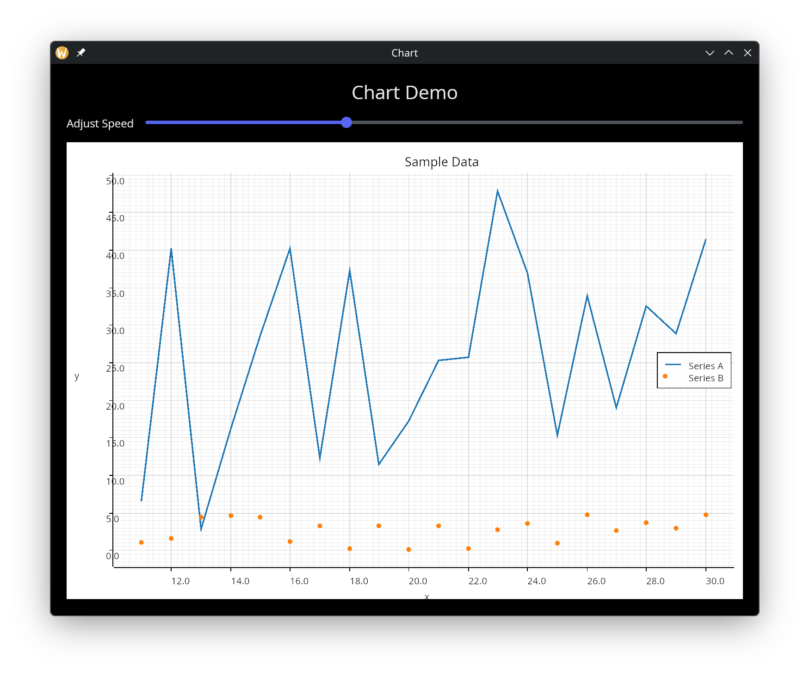

# The Chart Widget

The `chart` widget renders data visualizations with multiple datasets, axis labels, and automatic or manual axis scaling. It supports line charts, scatter plots, bar charts, and area charts, making it suitable for dashboards, data exploration, and real-time monitoring.

## Interface

```graphix
type ChartType = [`Line, `Scatter, `Bar, `Area];

type Dataset = {
  data: &Array<(f64, f64)>,
  chart_type: ChartType,
  color: [Color, null],
  label: [string, null]
};

val chart: fn(
  ?#title: &[string, null],
  ?#x_label: &[string, null],
  ?#y_label: &[string, null],
  ?#x_range: &[{min: f64, max: f64}, null],
  ?#y_range: &[{min: f64, max: f64}, null],
  ?#width: &Length,
  ?#height: &Length,
  &Array<Dataset>
) -> Widget
```

## Parameters

- **title** - Chart title displayed above the plot area. Null for no title.
- **x_label** - Label for the x-axis. Null for no label.
- **y_label** - Label for the y-axis. Null for no label.
- **x_range** - Manual x-axis range as `{min: f64, max: f64}`. When null, the range is computed automatically from the data.
- **y_range** - Manual y-axis range as `{min: f64, max: f64}`. When null, the range is computed automatically from the data.
- **width** - Horizontal sizing as a `Length`. Defaults to `` `Shrink ``.
- **height** - Vertical sizing as a `Length`. Defaults to `` `Shrink ``.

The positional argument is a reference to an array of `Dataset` values. Multiple datasets can be plotted on the same axes.

## Chart Types

- `` `Line `` -- Points connected by straight line segments. Good for time series and trends.
- `` `Scatter `` -- Individual points without connecting lines. Good for showing distributions and correlations.
- `` `Bar `` -- Vertical bars from the x-axis to each data point. Good for categorical comparisons.
- `` `Area `` -- Like `` `Line `` but with the region between the line and the x-axis filled in. Good for showing magnitude over time.

## Dataset Fields

Each `Dataset` struct has four fields:

- **data** - A reference to an array of `(f64, f64)` points. Because this is a reference, the chart updates reactively when the data changes.
- **chart_type** - One of the `ChartType` variants controlling how the data is rendered.
- **color** - Color for the dataset as a `Color` struct. When null, a color is assigned automatically.
- **label** - Display name for the dataset, shown in the chart legend. When null, no legend entry is created.

## Examples

### Multiple Datasets

```graphix
{{#include ../../examples/gui/chart.gx}}
```



## See Also

- [canvas](canvas.md) - Low-level drawing for custom visualizations
