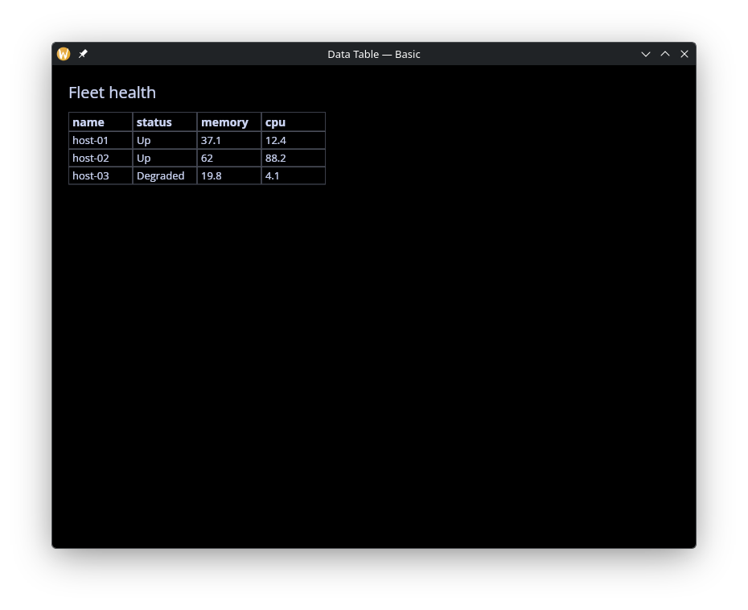
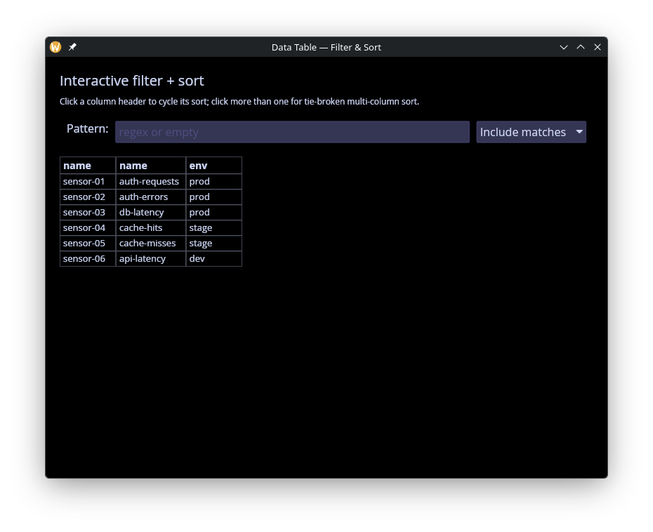
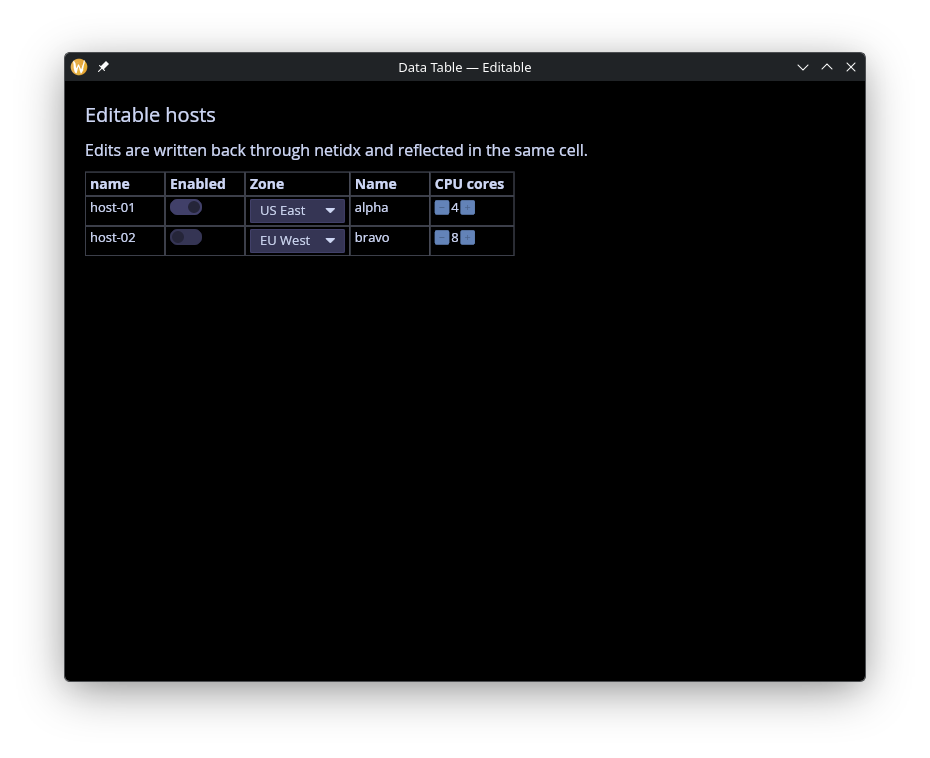
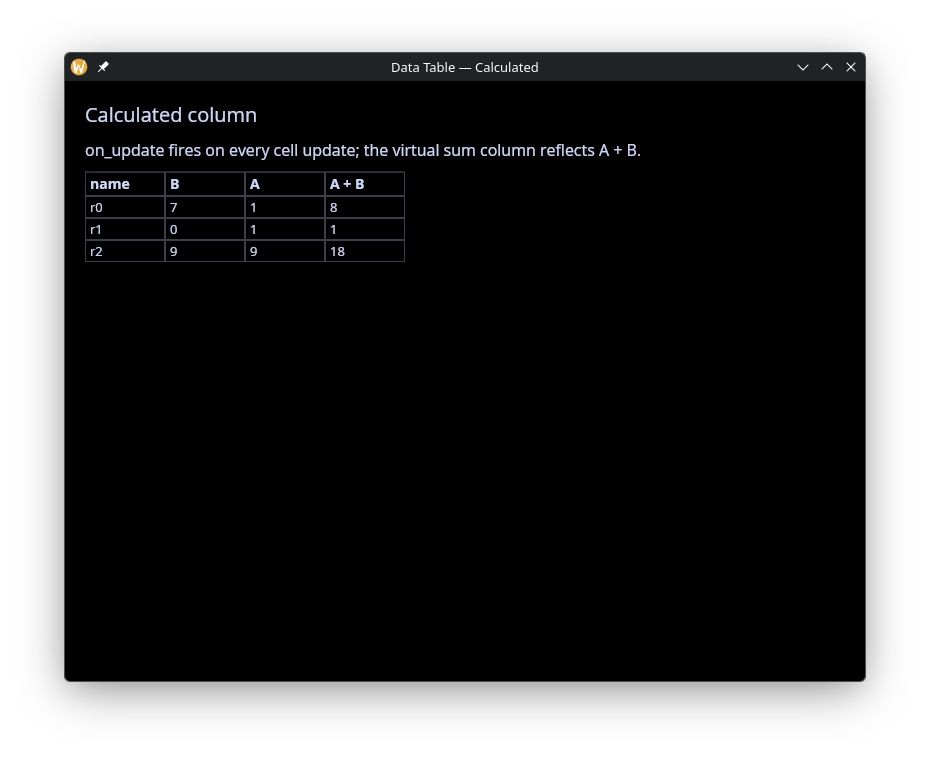
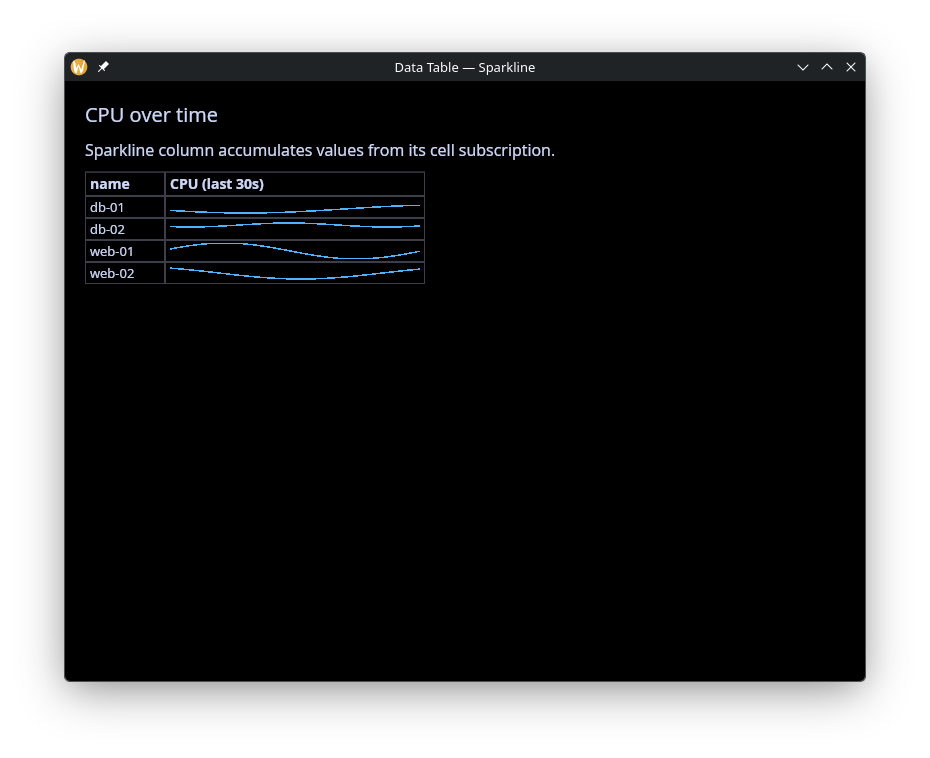
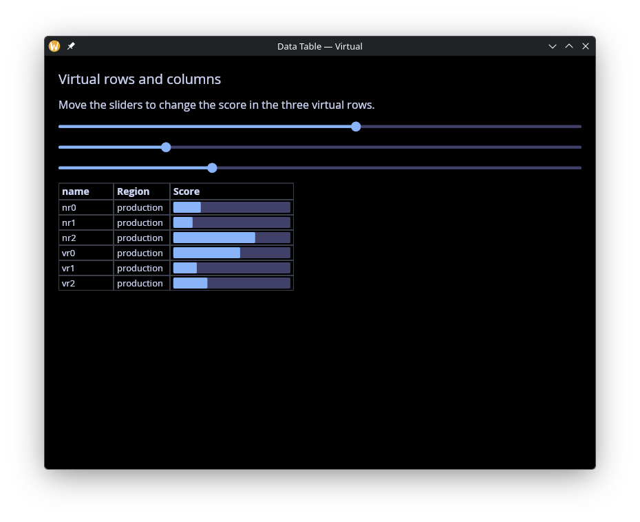

# The Data Table Widget

A spreadsheet-style widget that renders a `Table` value as a grid of
live-subscribed cells. Columns are typed: each one picks the editor
(text, toggle, pick-list, spinner), visualization (progress bar,
sparkline), or action (button) that cells should use. Row sort, row
filter, column widths, and the selection set are all controlled from
graphix — the widget is the rendering surface and the subscription
manager, nothing more.

The `Table` value is the single source of truth for what columns
exist, in what order, and how each one is sourced. Columns are
declared as either bare strings (shorthand for a default Text column
with `` `Netidx `` source named after the string) or full
`ColumnSpec` structs. Bare strings let the output of
`sys::net::list_table` (which has `columns: Array<string>`) flow
straight through; mixed arrays are fine.

Rows that are absolute netidx paths trigger live subscriptions for
every column whose `source` is `` `Netidx ``. Non-absolute row names
render as *virtual* rows. Columns whose `source` is a `string` or
`Map<string, Any>` skip subscription entirely and read their values
from the source ref.

## Interface

```graphix
type SortDirection = [`Ascending, `Descending];
type SortBy = { column: string, direction: SortDirection };

type ColumnType = [
    `Text({ on_edit: [fn(#path: string, #value: Any) -> Any, null] }),
    `Toggle({ on_edit: [fn(#path: string, #value: bool) -> Any, null] }),
    `Combo({
        choices: Array<{ id: string, label: string }>,
        on_edit: [fn(#path: string, #value: string) -> Any, null]
    }),
    `Spin({
        min: f64,
        max: f64,
        increment: f64,
        on_edit: [fn(#path: string, #value: f64) -> Any, null]
    }),
    `Progress,
    `Button({
        on_click: [fn(#path: string, #value: Any) -> Any, null]
    }),
    `Sparkline({
        history_seconds: f64,
        min: [f64, null],
        max: [f64, null]
    })
];

type Source = [`Netidx, string, Map<string, Any>];

type ColumnSpec = {
    name: string,
    typ: ColumnType,
    display_name: [string, null],
    source: &Source,
    on_resize: &[fn(f64) -> Any, null],
    width: &[f64, null]
};

type Table = {
    rows: Array<string>,
    columns: Array<[string, ColumnSpec]>
};

val data_table: fn(
    ?#sort_by: &Array<SortBy>,
    ?#selection: &Array<string>,
    ?#show_row_name: &bool,
    ?#on_select: [fn(#path: string) -> Any, null],
    ?#on_activate: [fn(#path: string) -> Any, null],
    ?#on_header_click: [fn(#column: string) -> Any, null],
    ?#on_update: [fn(#path: string, #value: Primitive) -> Any, null],
    #table: &Table
) -> Widget;

val text_column: fn(
    #name: string,
    ?#on_edit: [fn(#path: string, #value: Any) -> Any, null],
    ?#display_name: [string, null],
    ?#source: &Source,
    ?#on_resize: &[fn(f64) -> Any, null],
    ?#width: &[f64, null]
) -> ColumnSpec;
// (toggle_column, combo_column, spin_column, progress_column,
//  button_column, sparkline_column have the same shape — each takes
//  #name plus its kind-specific args, and accepts the same source /
//  width / on_resize options.)
```

## `data_table` Parameters

- **`#table`** -- The table shape: `{ rows: Array<string>, columns:
  Array<[string, ColumnSpec]> }`. `sys::net::list_table(path)`
  produces a value whose `columns: Array<string>` unifies with this
  type via the union element. The caller owns the shape: to filter,
  sort, hide, or reorder rows and columns — or to attach custom
  `ColumnSpec`s to specific columns — build the `Table` record in
  graphix and hand the result to `data_table`. Every change to this
  ref is reconciled against the current subscription set.

- **`#sort_by`** -- Array of sort keys applied in order. The first is
  the primary sort; later keys break ties. Empty list (the default)
  preserves the `Table`'s row order. Sort values come from the column's
  source — a live subscription when source is `` `Netidx ``, or the
  source's stored value otherwise.

- **`#selection`** -- Controlled set of selected cell paths. For
  cells in the row-name column this is just `"row_path"`; for every
  other cell it is `"row_path/col_name"`. The widget's own click /
  keyboard handlers never mutate this ref directly — they fire
  `#on_select` and `#on_activate` callbacks that the caller uses to
  drive the ref however they want (single-select, multi-select,
  toggle, etc.).

- **`#show_row_name`** -- When `true` (the default) a synthesized
  leftmost column shows each row's basename (`Path::basename(row)`).
  Set `false` for tables where the row identity is already carried
  by a regular column.

- **`#on_select`** -- Fired whenever a cell is clicked or keyboard
  navigation lands on a cell. The callback receives the full cell
  path (`"row_path/col_name"` for data cells, `"row_path"` for the
  row-name column).

- **`#on_activate`** -- Fired when the user clicks a row-name cell
  or presses Enter while a row is selected. Receives the row path.

- **`#on_header_click`** -- Fired when the user clicks a data
  column's header label. Receives the column name.

- **`#on_update`** -- Fired once per subscription update on every
  cell — useful when you want to mirror live values into graphix
  state (e.g. re-derive an aggregate) without subscribing separately.
  Receives the cell path and new value.

## Column Types

Each `ColumnSpec` carries a `typ: ColumnType` picked with one of the
helper constructors. All constructors take `#name: string` plus
their kind-specific args (`#on_edit` / `#on_click` / `#choices` /
etc.) and the common appearance options (`#display_name`, `#source`,
`#width`, `#on_resize`).

- **`text_column`** -- Plain text. With `on_edit` the cell becomes
  editable: clicking a selected cell opens a text field; `Enter`
  commits the typed value via `on_edit`, `Escape` cancels. The
  widget attempts to parse the buffer as a typed graphix value; if
  parsing fails the raw string is sent instead, so users can enter
  `hello` without quotes.

- **`toggle_column`** -- Renders a toggler. Cell values `"true"` or
  `"1"` turn it on. With `on_edit` the user can flip the toggle.

- **`combo_column`** -- Drop-down with a fixed set of `choices`. Each
  choice has an `id` (the raw value published / sent back through
  `on_edit`) and a `label` (what the user sees).

- **`spin_column`** -- Numeric spinner with `min`, `max`, and
  `increment` bounds; `on_edit` receives the clamped new value.

- **`progress_column`** -- Read-only progress bar. Cell values are
  clamped to `[0, 1]`.

- **`button_column`** -- Each cell renders as a button labelled with
  the cell's current value. `on_click` fires with the cell path and
  current value.

- **`sparkline_column`** -- Rolling-line visualization accumulating
  published values over `history_seconds`. By default the y-axis is
  shared across every cell in the column (auto-scaled to the union of
  all rows' values) so cells are visually comparable. Pass `#min` /
  `#max` to fix the axis instead.

## Column Widths and Resizing

Widths are controlled by two refs per column:

- **`width: &[f64, null]`** -- When `Some(f64)` the column is pinned
  to that width (and the resize handle at the column header vanishes
  unless an `on_resize` callback is also set). When `null` the
  column auto-sizes to its content, with a per-column cap (default
  300px).

- **`on_resize: &[fn(f64) -> Any, null]`** -- Fired while the user
  drags a column header's right edge. The callable receives the new
  pixel width. The reference is a `&` field so the callable can be
  swapped, nulled, or initialized reactively.

Double-clicking any column's resize handle auto-fits *every* column
to the widest cell in the entire table (not just the visible window).

## Source: Where Cell Values Come From

Each `ColumnSpec.source` is a `&Source` ref that decides where the
column's per-cell values originate:

- **`` `Netidx ``** -- The column subscribes to
  `<row_path>/<column_name>` for every row whose path is absolute.
  Cell values come from the subscription. This is the default for the
  column-builder helpers and the implicit behavior for bare-string
  entries in `Table.columns`.
- **`string`** -- A uniform value: every cell in the column renders
  this text. No subscription. Useful for static fields and computed
  columns where one value applies to all rows.
- **`Map<string, Any>`** -- Per-row values keyed by the row's
  basename. No subscription. Rows without a matching key render
  blank. Useful for "calculated" columns whose values are derived in
  graphix.

When the source ref updates reactively (e.g. the map changes), the
widget re-reads it and refreshes the affected cells. Sparkline
columns additionally push each new numeric source value into the
rolling history, so a virtual-column sparkline fed from graphix state
accumulates points the same way a subscribed one does.

## Keyboard Navigation

The widget is focusable: clicking into it grants keyboard focus.
Arrow keys move the selection (the currently-rendered selected cell
scrolls into view as needed). `Enter` on a row-name cell fires
`on_activate`; `Space` on an editable cell opens its editor;
`Escape` cancels an in-progress edit.

## Examples

### Basic

Minimal usage: publish three hosts and hand the
`sys::net::list_table` output to `data_table` with no column
configuration. Bare-string columns become default Text columns with
`` `Netidx `` source.

```graphix
{{#include ../../examples/gui/data_table_basic.gx}}
```



### Filter and Sort

Row filtering (a regex over basenames) and sort configuration done
in graphix before the `Table` is handed to the widget. Shows how the
caller owns the data pipeline end to end.

```graphix
{{#include ../../examples/gui/data_table_filter_sort.gx}}
```



### Editable

Every editable column type in one place: `Text`, `Toggle`, `Combo`,
`Spin`. Each cell is published with an `on_write` handler so edits
round-trip through netidx. The example shows the
`array::map(raw_columns, …)` pattern for attaching custom
`ColumnSpec`s to specific column names while leaving everything else
as bare-string Netidx-sourced columns.

```graphix
{{#include ../../examples/gui/data_table_editable.gx}}
```



### Calculated Columns

A virtual column whose `source` is a reactive `Map<string, Any>`,
rebuilt whenever any subscribed cell updates. Demonstrates deriving
per-row aggregates (here, sums) without touching netidx.

```graphix
{{#include ../../examples/gui/data_table_calculated.gx}}
```



### Sparkline

Live rolling charts per row with automatic column-wide y-axis
sharing, so cells are visually comparable without the caller picking
bounds.

```graphix
{{#include ../../examples/gui/data_table_sparkline.gx}}
```



### Virtual Rows and Columns

Mix live subscribed rows with virtual rows whose cells come from
non-Netidx sources. Virtual-column-plus-virtual-row combinations
give you fully client-side cells.

```graphix
{{#include ../../examples/gui/data_table_virtual.gx}}
```



### Dashboard

Kitchen-sink example combining `Combo` state pickers, `Sparkline`
CPU metrics, `Progress` uptime, a `Button` action column, a regex
row filter in a text input, sort controlled by pick-lists, and
selection echoed in the footer.

```graphix
{{#include ../../examples/gui/data_table_dashboard.gx}}
```


## See Also

- [Table](table.md) -- static row/column layout from graphix
  widgets, no netidx subscriptions.
- [Chart](chart.md) -- larger-scale line / area / scatter plots.
- [`sys::net`](../../stdlib/sys/net.md) -- the `Table` record and
  `list_table` helper consumed by `#table`.
