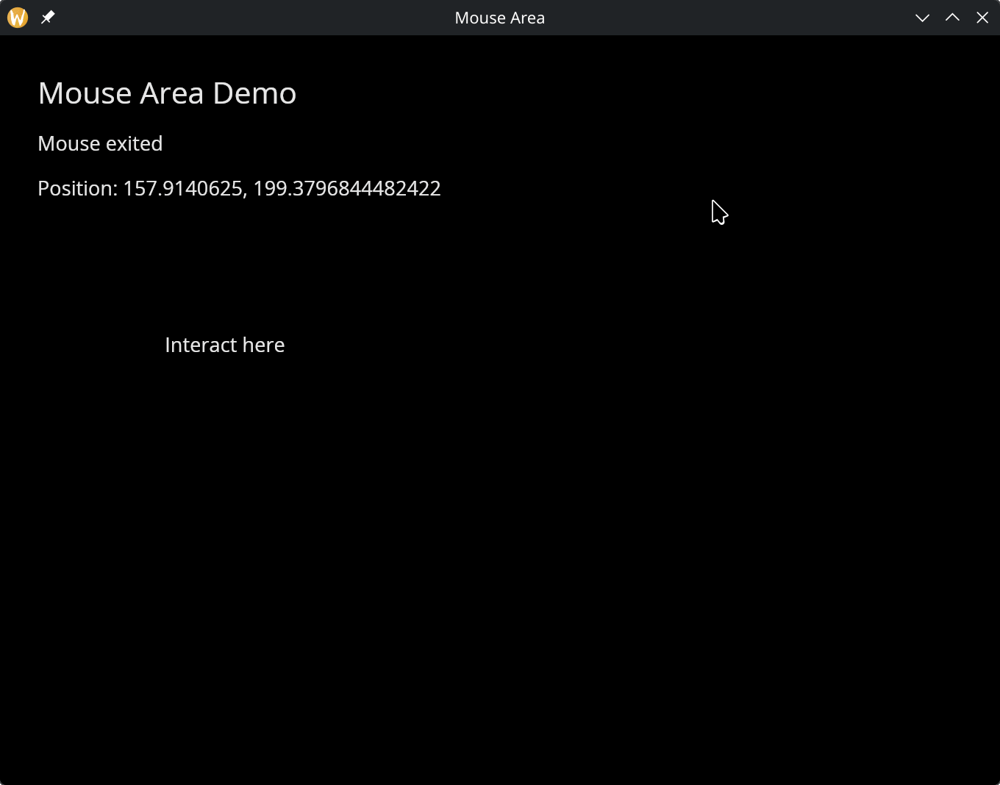

# The Mouse Area Widget

The `mouse_area` widget wraps a child and captures mouse events within its bounds. Use it to add click, hover, and movement tracking to any widget.

## Interface

```graphix
type MouseButton = [`Left, `Right, `Middle];

val mouse_area: fn(
  ?#on_press: fn(a: MouseButton) -> Any,
  ?#on_release: fn(a: MouseButton) -> Any,
  ?#on_enter: fn(a: null) -> Any,
  ?#on_exit: fn(a: null) -> Any,
  ?#on_move: fn(a: {x: f64, y: f64}) -> Any,
  a: &Widget
) -> Widget
```

## Parameters

- **on_press** — called when a mouse button is pressed inside the area. Receives a `MouseButton` variant (`` `Left ``, `` `Right ``, or `` `Middle ``).
- **on_release** — called when a mouse button is released inside the area. Receives a `MouseButton` variant.
- **on_enter** — called when the mouse cursor enters the area
- **on_exit** — called when the mouse cursor leaves the area
- **on_move** — called with `{x, y}` coordinates as the mouse moves within the area

The positional argument is a reference to the child widget.

## Examples

```graphix
{{#include ../../examples/gui/mouse_area.gx}}
```



## See Also

- [Keyboard Area](keyboard_area.md) — keyboard event capture
- [Button](button.md) — simpler click handling
- [Tooltip](tooltip.md) — hover-triggered popups
