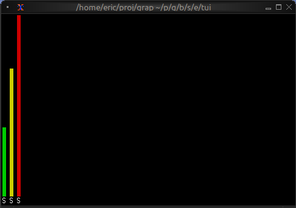

# The Bar Chart Widget

The `barchart` widget displays categorical data as vertical bars, supporting grouped bars, custom styling, and dynamic updates. It's ideal for comparing values across categories, showing rankings, or displaying resource usage.

## Interface

```graphix
type Bar = {
  label: &[Line, null],
  style: &[Style, null],
  text_value: &[string, null],
  value: &i64,
  value_style: &[Style, null]
};

val bar: fn(
  ?#label: &[Line, null],
  ?#style: &[Style, null],
  ?#text_value: &[string, null],
  ?#value_style: &[Style, null],
  &i64
) -> Bar;

type BarGroup = {
  bars: Array<Bar>,
  label: [Line, null]
};

val bar_group: fn(
  ?#label: [Line, null],
  Array<Bar>
) -> BarGroup;

val bar_chart: fn(
  ?#bar_gap: &[i64, null],
  ?#bar_style: &[Style, null],
  ?#bar_width: &[i64, null],
  ?#direction: &[Direction, null],
  ?#group_gap: &[i64, null],
  ?#label_style: &[Style, null],
  ?#max: &[i64, null],
  ?#style: &[Style, null],
  ?#value_style: &[Style, null],
  &Array<BarGroup>
) -> Tui;
```

## Parameters

### bar_chart
- **max** - Maximum value for chart scale (auto-scales if not specified)
- **bar_width** - Width of each bar in characters
- **bar_gap** - Space between bars within a group
- **group_gap** - Space between bar groups
- **style** - Base style for the chart

### bar_group
- **label** - Line labeling the group (displayed below bars)

### bar
- **style** - Style for the bar
- **label** - Line labeling the bar
- **text_value** - Line displayed above bar (defaults to numeric value)

## Examples

### Basic Usage

```graphix
{{#include ../../examples/tui/barchart_basic.gx}}
```


### Grouped Bars with Dynamic Data

```graphix
{{#include ../../examples/tui/barchart_grouped.gx}}
```


### Color-coded Values

```graphix
{{#include ../../examples/tui/barchart_colored.gx}}
```



## See Also

- [chart](chart.md) - For continuous data visualization
- [sparkline](sparkline.md) - For compact trend display
- [gauge](gauge.md) - For single value display
