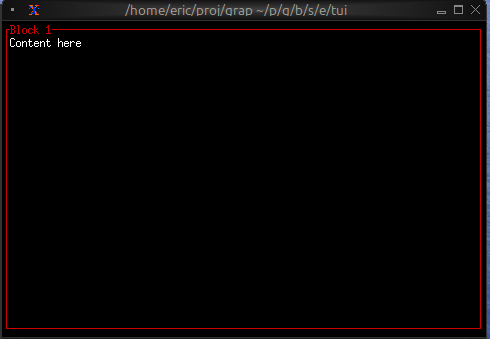

# The Block Widget

The `block` widget is a container that wraps other widgets with optional borders, titles, and styling. It's one of the most commonly used widgets for creating structured layouts and visually separating different sections of your TUI.

## Interface

```graphix
type Border = [
  `Top,
  `Right,
  `Bottom,
  `Left
];

type BorderType = [
  `Plain,
  `Rounded,
  `Double,
  `Thick,
  `QuadrantInside,
  `QuadrantOutside
];

type Padding = {
  bottom: i64,
  left: i64,
  right: i64,
  top: i64
};

type Position = [
  `Top,
  `Bottom
];

val block: fn(
  ?#border: &[Array<Border>, `All, `None, null],
  ?#border_type: &[BorderType, null],
  ?#border_style: &[Style, null],
  ?#padding: &[Padding, null],
  ?#style: &[Style, null],
  ?#title: &[Line, null],
  ?#title_top: &[Line, null],
  ?#title_bottom: &[Line, null],
  ?#title_style: &[Style, null],
  ?#title_position: &[Position, null],
  ?#title_alignment: &[Alignment, null],
  ?#size: &[Size, null],
  &Tui
) -> Tui;
```

## Parameters

- **border** - Border style: `All`, `None`, `Top`, `Bottom`, `Left`, or `Right`
- **border_style** - Style for the border
- **title** - Line displayed at the top of the block
- **title_bottom** - Line displayed at the bottom of the block
- **style** - Style for the block's interior
- **size** (output) - Rendered size of the block

## Examples

### Basic Usage

```graphix
{{#include ../../examples/tui/block_basic.gx}}
```


### Focus Indication

Use dynamic styling to show which block has focus:

```graphix
{{#include ../../examples/tui/block_focus.gx}}
```



### Dynamic Titles

Titles can contain reactive values that update automatically:

```graphix
{{#include ../../examples/tui/block_dynamic_title.gx}}
```


## See Also

- [layout](layout.md) - For arranging multiple blocks
- [paragraph](paragraph.md) - Common content for blocks
- [text](text.md) - For creating styled text content
