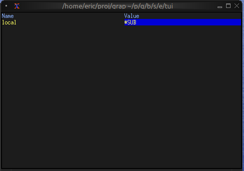
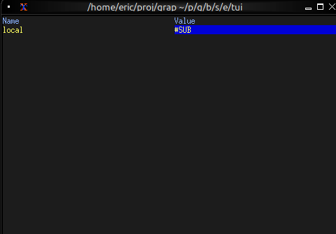

# The Browser Widget

The `browser` widget provides a specialized interface for browsing and interacting with netidx hierarchies. It displays netidx paths in a tree structure with keyboard navigation, selection, and cursor movement support.

## Interface

```graphix
type MoveCursor = [
    `Left(i64),
    `Right(i64),
    `Up(i64),
    `Down(i64)
];

val browser: fn(
    ?#selected_style: Style,
    ?#header_style: Style,
    ?#style: Style,
    ?#cursor: MoveCursor,
    ?#selected_row: &string,
    ?#selected_path: &string,
    ?#flex: Flex,
    ?#rate: duration,
    #size: Size,
    string
) -> Tui throws Error<ErrChain<`ArithError(string)>>;
```

## Parameters

- **cursor** - Programmatic cursor movement: `Left(n)`, `Right(n)`, `Up(n)`, `Down(n)`
- **selected_row** (output) - Display name of the selected row
- **selected_path** (output, required) - Full path of the currently selected item
- **size** (output) - Rendered size of the browser

## Examples

### Basic Usage

```graphix
{{#include ../../examples/tui/browser_basic.gx}}
```



### Basic Navigation

```graphix
{{#include ../../examples/tui/browser_navigation.gx}}
```



## See Also

- [list](list.md) - For simpler selection interfaces
- [table](table.md) - For tabular data display
- [block](block.md) - For containing browsers with borders
