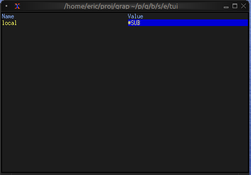
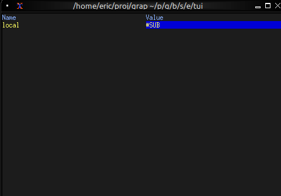

# The Browser Widget

The `browser` widget provides a specialized interface for browsing and interacting with netidx hierarchies. It displays netidx paths in a tree structure with keyboard navigation, selection, and cursor movement support.

## Interface

```graphix
type MoveCursor = [
    `Left(i64),
    `Right(i64),
    `Up(i64),
    `Down(i64)
];

val browser: fn(
    ?#selected_style: Style,
    ?#header_style: Style,
    ?#style: Style,
    ?#cursor: MoveCursor,
    ?#selected_row: &mut string,
    ?#selected_path: &mut string,
    ?#flex: Flex,
    ?#rate: duration,
    #size: Size,
    path: string
) -> Tui;
```

## Parameters

- **path** - The netidx path whose children are listed. The listing is fetched once each time `path` changes, so rows published later appear when the path next changes
- **cursor** - Programmatic cursor movement: `Left(n)`, `Right(n)`, `Up(n)`, `Down(n)`
- **selected_row** (output) - Full path of the selected row (e.g. `/t/r1`)
- **selected_path** (output) - Full path of the selected cell: the row in a list, the row and column in a table
- **size** (input) - The area the browser is drawn in, which sizes its viewport; pass the enclosing block's `#size` output

## Examples

### Basic Usage

```graphix
{{#include ../../examples/tui/browser_basic.gx}}
```



### Basic Navigation

```graphix
{{#include ../../examples/tui/browser_navigation.gx}}
```



### Commands

A `:` command line beside the browser: `:w <value>` writes the value to
the selected path, and an error from the command shows in the bottom
title.

```graphix
{{#include ../../examples/tui/browser_commands.gx}}
```

## See Also

- [list](list.md) - For simpler selection interfaces
- [table](table.md) - For tabular data display
- [block](block.md) - For containing browsers with borders
