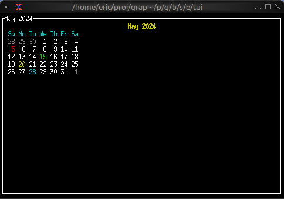
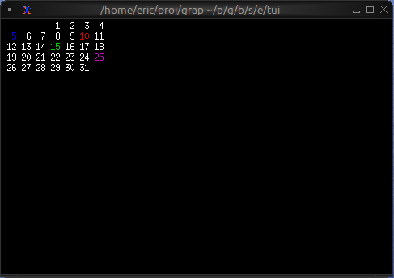

# The Calendar Widget

The `calendar` widget displays a monthly calendar view with support for highlighting specific dates and displaying events. It's perfect for date pickers, event schedulers, and time-based visualizations.

## APIs

```
mod calendar: sig {
    /// Creates a calendar widget displaying a month
    val calendar: fn(
        ?#show_month: &Style,
        ?#show_weekday: &Style,
        ?#show_surrounding: &Style,
        ?#events: &Array<CalendarEvent>,
        &Date
    ) -> Widget;

    /// Creates an event marker for a specific date
    val calendar_event: fn(Style, Date) -> CalendarEvent;

    /// Creates a date object
    val date: fn(i64, i64, i64) -> Date;  // (year, month, day)
}
```

## Parameters

### calendar
- **show_month** - Style for the month header
- **show_weekday** - Style for weekday headers (Mon, Tue, etc.)
- **show_surrounding** - Style for dates from surrounding months
- **events** - Array of CalendarEvent objects to highlight dates

### calendar_event
Takes a style and a date to create an event marker.

### date
Creates a date with year, month (1-12), and day (1-31).

## Examples

### Basic Usage

```graphix
{{#include ../../examples/tui/calendar_basic.gx}}
```


### Event Calendar

```graphix
{{#include ../../examples/tui/calendar_events.gx}}
```



### Color-coded Events by Type

```graphix
{{#include ../../examples/tui/calendar_typed.gx}}
```




## See Also

- [table](table.md) - For tabular date-based data
- [list](list.md) - For event lists
- [block](block.md) - For containing calendars with borders
