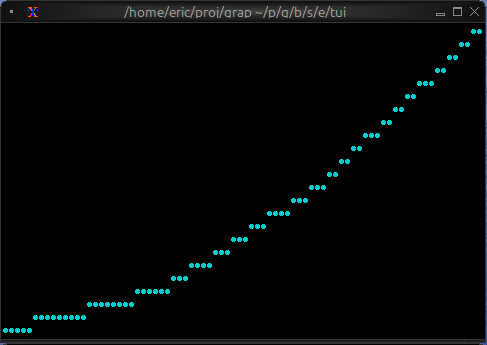

# The Chart Widget

The `chart` widget renders line charts with multiple datasets, custom axes, labels, and styling. It's ideal for visualizing time series data, trends, sensor readings, and any numeric data relationships.

## Interface

```graphix
type GraphType = [
  `Scatter,
  `Line,
  `Bar
];

type LegendPosition = [
  `Top,
  `TopRight,
  `TopLeft,
  `Left,
  `Right,
  `Bottom,
  `BottomRight,
  `BottomLeft
];

type Axis = {
  bounds: {min: f64, max: f64},
  labels: [Array<Line>, null],
  labels_alignment: [Alignment, null],
  style: [Style, null],
  title: [Line, null]
};

val axis: fn(
  ?#labels: [Array<Line>, null],
  ?#labels_alignment: [Alignment, null],
  ?#style: [Style, null],
  ?#title: [Line, null],
  {min: f64, max: f64}
) -> Axis;

type Dataset = {
  data: &Array<(f64, f64)>,
  graph_type: &[GraphType, null],
  marker: &[Marker, null],
  name: &[Line, null],
  style: &[Style, null]
};

val dataset: fn(
  ?#marker: &[Marker, null],
  ?#graph_type: &[GraphType, null],
  ?#name: &[Line, null],
  ?#style: &[Style, null],
  &Array<(f64, f64)>
) -> Dataset;

val chart: fn(
  ?#hidden_legend_constraints: &[LegendConstraints, null],
  ?#legend_position: &[LegendPosition, null],
  ?#style: &[Style, null],
  ?#x_axis: &[Axis, null],
  ?#y_axis: &[Axis, null],
  &Array<Dataset>
) -> Tui;
```

## Parameters

### chart
- **style** - Background style for the chart area
- **x_axis** - X-axis configuration (required)
- **y_axis** - Y-axis configuration (required)

### axis
- **title** - Line for axis title
- **labels** - Array of lines displayed along axis
- **style** - Style for axis lines and ticks

### dataset
- **style** - Style for the dataset (line and markers)
- **graph_type** - `Line` or `Scatter`
- **marker** - `Dot`, `Braille`, or `Block`
- **name** - Line naming the dataset (for legends)

## Examples

### Basic Usage

```graphix
{{#include ../../examples/tui/chart_basic.gx}}
```



### Real-time Data Visualization

```graphix
{{#include ../../examples/tui/chart_realtime.gx}}
```


### Multiple Datasets

```graphix
{{#include ../../examples/tui/chart_multi.gx}}
```


## Marker Comparison

- **Dot**: Fastest, lowest resolution, good for dense data
- **Braille**: Smoothest curves, medium performance, best visual quality
- **Block**: High contrast, medium performance

## See Also

- [barchart](barchart.md) - For categorical data visualization
- [sparkline](sparkline.md) - For compact inline charts
- [canvas](canvas.md) - For custom graphics
