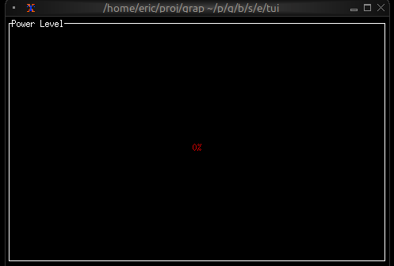

# The Gauge Widget

The `gauge` widget displays a single value as a filled progress indicator, perfect for showing percentages, completion status, or resource usage. It provides a clear visual representation of how full or complete something is.

## Interface

```graphix
val gauge: fn(
  ?#gauge_style: &[Style, null],
  ?#label: &[Span, null],
  ?#style: &[Style, null],
  ?#use_unicode: &[bool, null],
  &f64
) -> Tui;
```

## Parameters

- **gauge_style** - Style for the filled portion
- **label** - Line or span displayed in the center
- **use_unicode** - Use Unicode block characters for smoother rendering
- **style** - Style for the unfilled portion

## Examples

### Basic Usage

```graphix
{{#include ../../examples/tui/gauge_basic.gx}}
```


### Progress with Color Thresholds

```graphix
{{#include ../../examples/tui/gauge_threshold.gx}}
```



### Resource Usage

```graphix
{{#include ../../examples/tui/gauge_resource.gx}}
```


## See Also

- [linegauge](linegauge.md) - For horizontal line-based gauges
- [sparkline](sparkline.md) - For historical trend display
- [barchart](barchart.md) - For comparing multiple values
