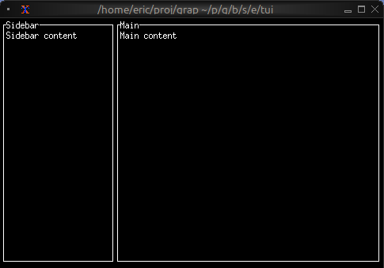
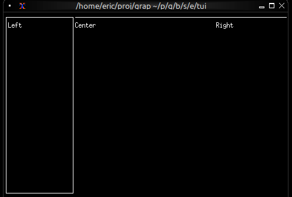
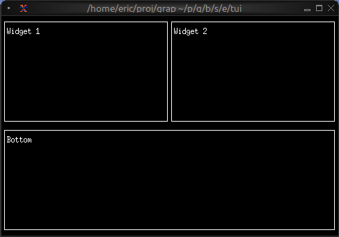
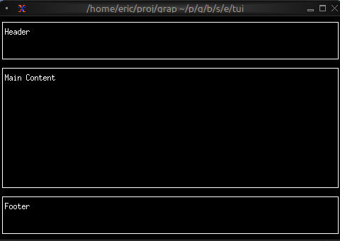

# The Layout Widget

The `layout` widget arranges child widgets in horizontal or vertical layouts with flexible sizing constraints. It's the primary tool for organizing complex TUI interfaces and supports focus management for interactive applications.

## Interface

```graphix
type Spacing = [
  `Space(i64),
  `Overlap(i64)
];

type Child = {
  child: Tui,
  constraint: Constraint,
  size: &[Size, null]
};

val child: fn(
  ?#size: &[Size, null],
  #constraint: Constraint,
  Tui
) -> Child;

val layout: fn(
  ?#direction: &[Direction, null],
  ?#flex: &[Flex, null],
  ?#focused: &[i64, null],
  ?#horizontal_margin: &[i64, null],
  ?#margin: &[i64, null],
  ?#spacing: &[Spacing, null],
  ?#vertical_margin: &[i64, null],
  &Array<Child>
) -> Tui;
```

## Parameters

- **direction** - `Horizontal` or `Vertical` (default: `Vertical`)
- **focused** - Index of the currently focused child (0-indexed)
- **flex** - Alignment when children don't fill space: `Start`, `Center`, `End`, `SpaceAround`, `SpaceBetween`

## Constraint Types

- **Percentage(n)** - Allocates n% of available space
- **Length(n)** - Fixed width/height in cells
- **Min(n)** - At least n cells
- **Max(n)** - At most n cells
- **Ratio(num, den)** - Fractional allocation (num/den)
- **Fill(n)** - Takes remaining space after other constraints

## Examples

### Basic Layout

```graphix
{{#include ../../examples/tui/layout_basic.gx}}
```



### Three-Pane Layout with Focus

```graphix
{{#include ../../examples/tui/layout_focus.gx}}
```



### Nested Layouts

```graphix
{{#include ../../examples/tui/layout_nested.gx}}
```



### Header/Content/Footer

```graphix
{{#include ../../examples/tui/layout_header_footer.gx}}
```



## See Also

- [block](block.md) - Common child widget for layouts
- [input_handler](../overview.md#input-handling) - For handling focus changes
