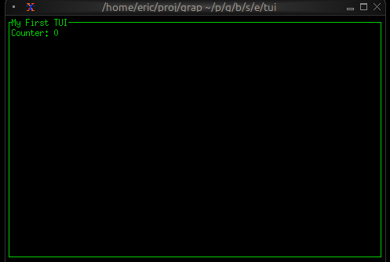

# Terminal User Interfaces (TUIs)

Graphix includes a comprehensive TUI library built on top of the popular Rust `ratatui` crate. This allows you to build rich, interactive terminal applications with:

### Core Components

The TUI library provides all the essential building blocks:

- **Layout**: Flexible container system with horizontal/vertical arrangement and various sizing constraints
- **Block**: Wrapper component that adds borders, titles, and styling to other components
- **Text**: Rich text rendering with styling, colors, and formatting
- **Paragraph**: Multi-line text with scrolling and word wrapping

### Interactive Widgets

- **Table**: Sortable, selectable data tables with custom styling
- **List**: Scrollable lists with selection and highlighting
- **Tabs**: Tabbed interface for organizing content
- **Browser**: Netidx browser component
- **Calendar**: Date picker and event display

### Data Visualization

- **Chart**: Line charts with multiple datasets, custom axes, and styling
- **Bar Chart**: Grouped and individual bar charts with labels
- **Sparkline**: Compact inline charts perfect for dashboards
- **Gauge**: Progress indicators and meters
- **Canvas**: Low-level drawing surface for custom graphics

### Input Handling

Interactive components use the input widget to handle UI events that
flow through the widget graph from parent to child. Parents can choose
to pass on events they receive or not. See the input widget for more
details.

## Building Your First TUI

Here's a simple example that demonstrates the core concepts:

```graphix
{{#include ../../examples/tui/overview_first.gx}}
```

This creates a bordered block with a counter that increments every second. The key insight is that when `counter` changes, the text automatically updates because of Graphix's reactive nature.



## Styling and Theming

Graphix TUIs support rich styling with:

- **Colors**: Named colors (`Red`, `Green`, `Blue`), indexed colors (`Indexed(202)`), and RGB (`Rgb({r: 255, g: 100, b: 50})`)
- **Text Effects**: Bold, italic, underline, strikethrough
- **Background Colors**: Set background colors for any component
- **Conditional Styling**: Use `select` expressions to change styles based on state

Many widgets take optional style arguments, allowing styling to be applied at many levels.

```graphix
{{#include ../../examples/tui/overview_styling.gx}}
```

## Layout System

The layout system provides flexible component arrangement:

- **Direction**: `Horizontal` or `Vertical`
- **Constraints**: `Percentage(50)`, `Length(20)`, `Min(10)`, `Max(100)`
- **Alignment**: `Left`, `Center`, `Right` for horizontal; `Top`, `Center`, `Bottom` for vertical
- **Focus Management**: Built-in focus handling for interactive components

```graphix
{{#include ../../examples/tui/overview_layout.gx}}
```

## State Management

In Graphix, UI state is just regular program state. Use variables to track:

- Selection states in lists and tables
- Input field contents
- Window/pane focus
- Application modes (normal, edit, command)

State changes automatically trigger UI updates:

```graphix
{{#include ../../examples/tui/overview_state.gx}}
```

## Real-time Data Integration

Graphix TUIs excel at displaying real-time data. Connect to data sources via netidx and the UI updates automatically:

```graphix
{{#include ../../examples/tui/overview_realtime.gx}}
```
