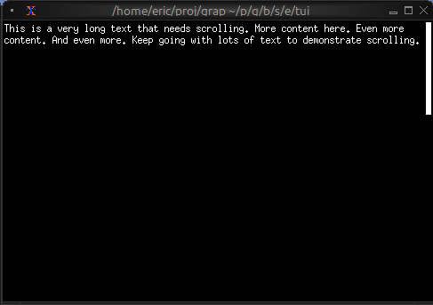
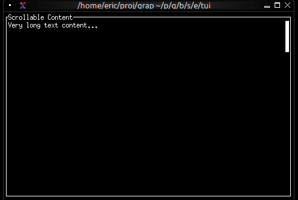
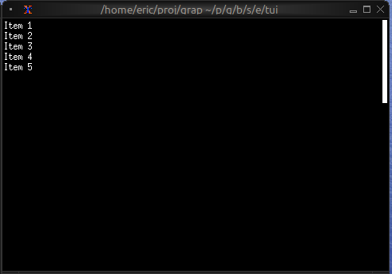

# The Scrollbar Widget

The `scrollbar` widget adds a visual scrollbar indicator to scrollable content, making it clear when content extends beyond the visible area and showing the current scroll position.

## Interface

```graphix
type ScrollbarOrientation = [
  `VerticalRight,
  `VerticalLeft,
  `HorizontalBottom,
  `HorizontalTop
];

val scrollbar: fn(
  ?#begin_style: &[Style, null],
  ?#begin_symbol: &[string, null],
  ?#content_length: &[i64, null],
  ?#end_style: &[Style, null],
  ?#end_symbol: &[string, null],
  ?#orientation: &[ScrollbarOrientation, null],
  ?#position: &[i64, null],
  ?#size: &[Size, null],
  ?#style: &[Style, null],
  ?#thumb_style: &[Style, null],
  ?#thumb_symbol: &[string, null],
  ?#track_style: &[Style, null],
  ?#track_symbol: &[string, null],
  ?#viewport_length: &[i64, null],
  &Tui
) -> Tui;
```

## Parameters

- **position** (required) - Current scroll position (typically the Y offset)
- **content_length** - Total length of the content (auto-detected if not specified)
- **size** (output) - Rendered size of the scrollbar area

## Examples

### Basic Usage

```graphix
{{#include ../../examples/tui/scroll_basic.gx}}
```



### Scrollable Paragraph

```graphix
{{#include ../../examples/tui/scroll_paragraph.gx}}
```



### Scrollable List

```graphix
{{#include ../../examples/tui/scroll_list.gx}}
```




## See Also

- [paragraph](paragraph.md) - For scrollable text content
- [list](list.md) - For scrollable lists
- [table](table.md) - For scrollable tables
- [block](block.md) - For containing scrollable content
