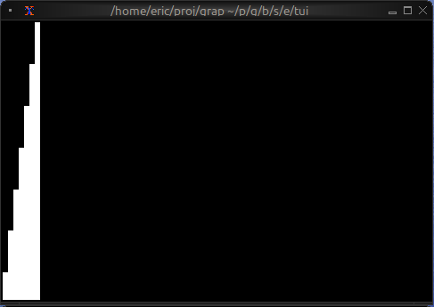
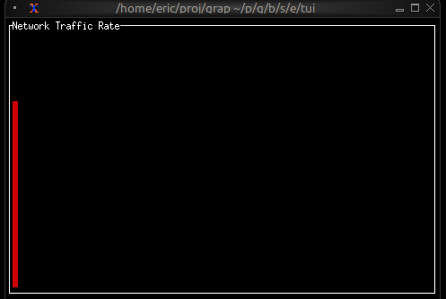
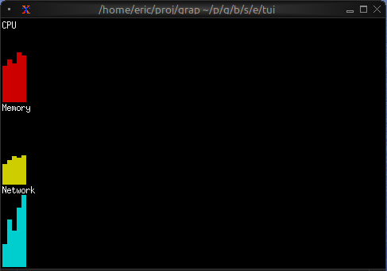
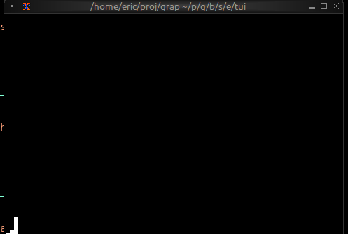

# The Sparkline Widget

The `sparkline` widget renders compact inline charts perfect for dashboards and status displays. It shows data trends in minimal space, with support for color-coded bars based on thresholds.

## Interface

```graphix
type RenderDirection = [
  `LeftToRight,
  `RightToLeft
];

type SparklineBar = {
  style: [Style, null],
  value: [f64, null]
};

val sparkline_bar: fn(
  ?#style: [Style, null],
  v: [f64, null]
) -> SparklineBar;

val sparkline: fn(
  ?#absent_value_style: &[Style, null],
  ?#absent_value_symbol: &[string, null],
  ?#direction: &[RenderDirection, null],
  ?#max: &[i64, null],
  ?#style: &[Style, null],
  a: &Array<[SparklineBar, f64, null]>
) -> Tui;
```

## Parameters

### sparkline
- **max** - Maximum value for scaling (auto-scales if not specified)
- **style** - Default style for bars
- **direction** - `LeftToRight` (default) or `RightToLeft`

### sparkline_bar
- **style** - Style for this specific bar

## Examples

### Basic Usage

```graphix
{{#include ../../examples/tui/sparkline_basic.gx}}
```



### Threshold-based Coloring

```graphix
{{#include ../../examples/tui/sparkline_threshold.gx}}
```



### Multi-metric Dashboard

```graphix
{{#include ../../examples/tui/sparkline_dashboard.gx}}
```



### Sparkline from Netidx

This example is self-contained: it both publishes and subscribes to a
simulated CPU value over netidx, so you can run it without any
external publisher. Drop the `publish` call and point the subscribe at
a real path to chart live data instead — for example, the output of:

```
top | \
grep --line-buffered Cpu | \
awk '{ printf("/local/metrics/cpu|f64|%s\n", $6); fflush() }' | \
netidx publisher
```

```graphix
{{#include ../../examples/tui/sparkline_rolling.gx}}
```



## Use Cases

Sparklines are ideal for:
- System resource monitoring (CPU, memory, network)
- Real-time metrics dashboards
- Compact data visualization in lists or tables
- Rate of change visualization

## See Also

- [chart](chart.md) - For detailed charts with axes
- [gauge](gauge.md) - For single current value display
- [linegauge](linegauge.md) - For horizontal progress bars
