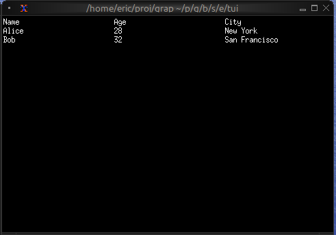
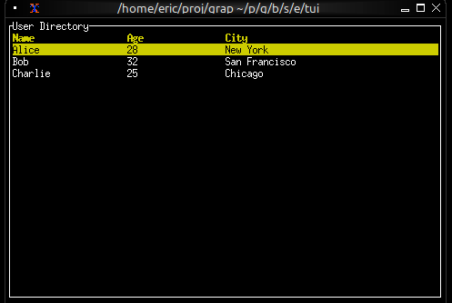
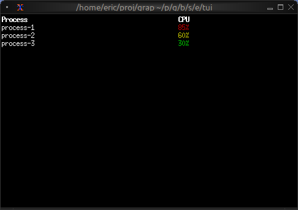
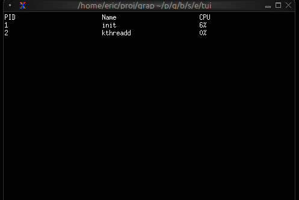

# The Table Widget

The `table` widget displays structured data in rows and columns with support for selection, scrolling, and custom styling. It's ideal for data grids, process monitors, file listings, and any tabular data display.

## Interface

```graphix
type Cell = {
  content: Line,
  style: [Style, null]
};

val cell: fn(
  ?#style: [Style, null],
  Line
) -> Cell;

type Row = {
  bottom_margin: [i64, null],
  cells: Array<Cell>,
  height: [i64, null],
  style: [Style, null],
  top_margin: [i64, null]
};

val row: fn(
  ?#bottom_margin: [i64, null],
  ?#height: [i64, null],
  ?#style: [Style, null],
  ?#top_margin: [i64, null],
  Array<Cell>
) -> Row;

val table: fn(
  ?#cell_highlight_style: &[Style, null],
  ?#column_highlight_style: &[Style, null],
  ?#column_spacing: &[i64, null],
  ?#flex: &[Flex, null],
  ?#footer: &[Row, null],
  ?#header: &[Row, null],
  ?#highlight_spacing: &[HighlightSpacing, null],
  ?#highlight_symbol: &[string, null],
  ?#row_highlight_style: &[Style, null],
  ?#selected: &[i64, null],
  ?#selected_cell: &[{x: i64, y: i64}, null],
  ?#selected_column: &[i64, null],
  ?#style: &[Style, null],
  ?#widths: &[Array<Constraint>, null],
  &Array<&Row>
) -> Tui;
```

## Parameters

- **header** - Row object for the table header
- **selected** - Index of the currently selected row
- **row_highlight_style** - Style for the selected row
- **highlight_symbol** - String before selected row
- **highlight_spacing** - When to show highlight symbol: `Always`, `WhenSelected`, `Never`
- **widths** - Array of column width constraints
- **column_spacing** - Number of spaces between columns
- **style** - Base style for the table

## Examples

### Basic Usage

```graphix
{{#include ../../examples/tui/table_basic.gx}}
```



### Interactive Table

```graphix
{{#include ../../examples/tui/table_interactive.gx}}
```



### Conditional Cell Styling

```graphix
{{#include ../../examples/tui/table_styled_cells.gx}}
```



### Real-time Updates

```graphix
{{#include ../../examples/tui/table_realtime.gx}}
```



## See Also

- [list](list.md) - For simpler single-column selection
- [scrollbar](scroll.md) - For adding scrollbars
- [block](block.md) - For containing tables with borders
