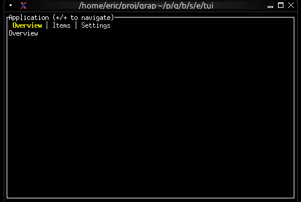
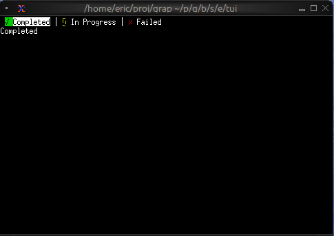

# The Tabs Widget

The `tabs` widget creates a tabbed interface for organizing content into multiple switchable panels. Each tab has a title displayed in the tab bar and associated content that's shown when the tab is selected.

## API

```
mod tabs: sig {
    /// Creates a tabbed interface from an array of (title, content) tuples
    val tabs: fn(
        ?#selected: &i64,
        ?#highlight_style: &Style,
        ?#style: &Style,
        ?#divider: &[string, Span],
        &Array<(Line, Widget)>
    ) -> Widget;
}
```

## Parameters

- **selected** - Index of the currently selected tab (0-indexed)
- **highlight_style** - Style for the selected tab title
- **style** - Base style for unselected tab titles
- **divider** - String or span separating tab titles

## Examples

### Basic Usage

```graphix
{{#include ../../examples/tui/tabs_basic.gx}}
```


### Navigation Between Tabs

```graphix
{{#include ../../examples/tui/tabs_navigation.gx}}
```



### Styled Tab Titles

```graphix
{{#include ../../examples/tui/tabs_styled.gx}}
```



### Tab with Badge

```graphix
{{#include ../../examples/tui/tabs_badge.gx}}
```


## Keyboard Navigation

Common patterns:
- `Left`/`Right` - Switch to previous/next tab
- `Tab` - Cycle forward through tabs
- Number keys - Jump directly to tab

## See Also

- [block](block.md) - For containing tabs with borders
- [list](list.md) - Common content for tabs
- [table](table.md) - For tabular content in tabs
