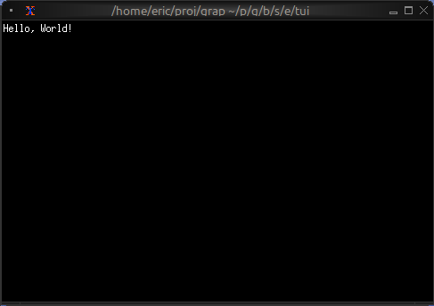
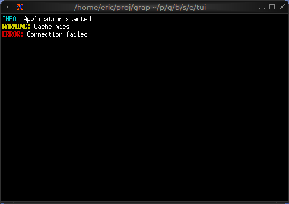
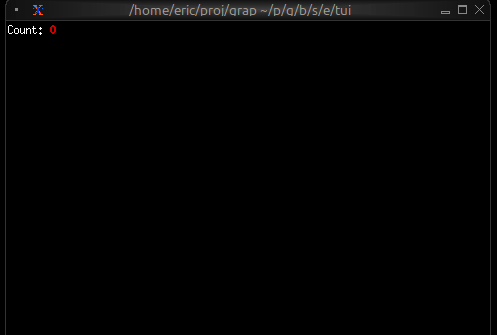
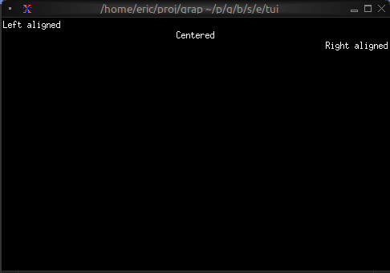

# The Text Widget

The `text` widget renders styled text in the terminal. It's a fundamental building block for displaying formatted content with colors, modifiers, and multiple lines. Text is built from `Line` objects, which are in turn composed of `Span` objects.

## Interface

```graphix
val text: fn(
  ?#style: &Style,
  ?#alignment: &[Alignment, null],
  &[Array<Line>, string]
) -> Tui;
```

The `text` widget uses types from the [style](style.md) module including `Style`, `Line`, `Span`, `Color`, `Modifier`, and `Alignment`.

## Text Hierarchy

- **Span**: A single segment of text with a single style
- **Line**: A collection of spans forming one line
- **Text**: A collection of lines forming multi-line content

## Examples

### Basic Usage

```graphix
{{#include ../../examples/tui/text_basic.gx}}
```



### Status Messages

```graphix
{{#include ../../examples/tui/text_status.gx}}
```



### Dynamic Colors

```graphix
{{#include ../../examples/tui/text_dynamic.gx}}
```



### Alignment

```graphix
{{#include ../../examples/tui/text_alignment.gx}}
```



## Color Support

- **Named colors**: `Red`, `Green`, `Blue`, `Yellow`, `Magenta`, `Cyan`, `White`, `Black`, `Gray`, `DarkGray`, and `Light*` variants
- **Indexed colors**: `Indexed(202)` for 256-color palette
- **RGB colors**: `Rgb({r: 255, g: 100, b: 50})` for true color

## Text Modifiers

- `Bold`, `Italic`, `Underlined`, `CrossedOut`
- `SlowBlink`, `RapidBlink` (terminal support varies)
- `Reversed`, `Hidden`

## See Also

- [paragraph](paragraph.md) - For wrapped and scrollable text
- [block](block.md) - For containing text with borders
- [list](list.md) - For selectable text items
